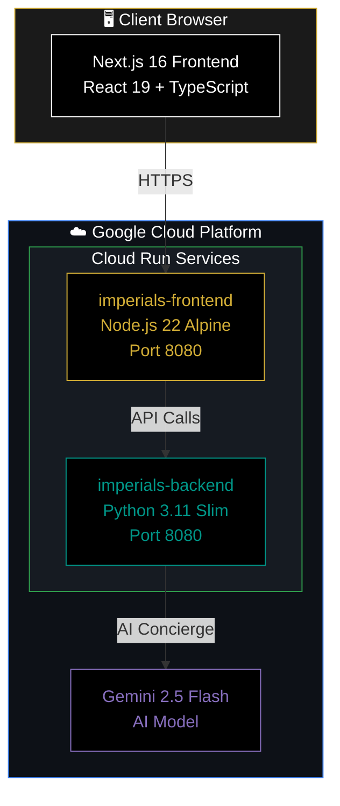
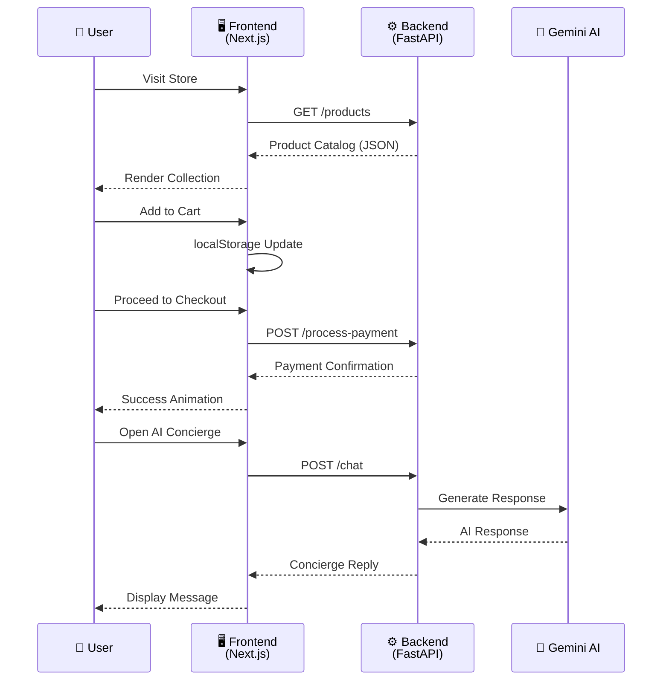
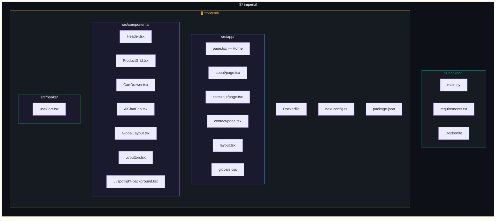
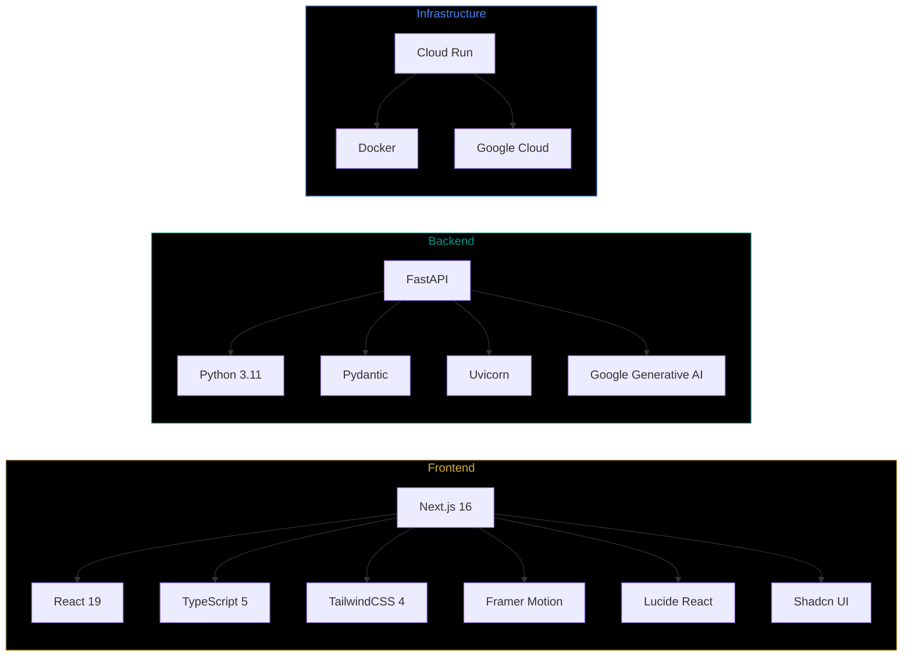

<p align="center">
  
</p>

<h1 align="center">✦ IMPERIALS ✦</h1>

<p align="center">
  <em>An Ultra-Luxury Fashion E-Commerce Experience</em>
</p>

<p align="center">
  
  
  
  
  
  
</p>

<p align="center">
  <a href="https://imperials-frontend-4hwdib62gq-uc.a.run.app"><strong>🌐 Live Demo</strong></a> &nbsp;·&nbsp;
  <a href="https://imperials-backend-4hwdib62gq-uc.a.run.app/docs"><strong>📡 API Docs</strong></a>
</p>

---

## 📖 Overview

**IMPERIALS** is a full-stack luxury fashion e-commerce platform built with a minimalist editorial aesthetic. It combines a blazing-fast **Next.js 16** frontend with a robust **FastAPI** backend, powered by **Google Gemini AI** for an intelligent personal shopping concierge. The entire platform is containerized and deployed on **Google Cloud Run** for seamless scalability.

---

## 🏗️ System Architecture



---

## 🔄 Request Flow



---

## 📁 Project Structure



---

## ✨ Features

| Feature | Description |
|---------|-------------|
| 🛍️ **Product Catalog** | Curated luxury collection with elegant hover animations and responsive grid layout |
| 🛒 **Smart Cart** | Persistent shopping cart with localStorage, quantity management, and slide-out drawer |
| 💳 **Simulated Checkout** | Full checkout flow with payment processing simulation and success animations |
| 🤖 **AI Concierge** | Gemini-powered chat assistant with sophisticated luxury brand personality |
| 📬 **Contact Concierge** | Inquiry form with Google Maps integration for flagship boutique location |
| 🌟 **Spotlight Background** | Dynamic spotlight cursor effect using Framer Motion for premium feel |
| 📱 **Fully Responsive** | Optimized for all screen sizes from mobile to ultra-wide displays |

---

## 🛠️ Tech Stack



---

## 🚀 Getting Started

### Prerequisites

- **Node.js** >= 20.9.0
- **Python** >= 3.11
- **Docker** (optional, for containerized deployment)

### Local Development

#### 1. Clone the Repository

```bash
git clone https://github.com/DhruvGarg436/imperial.git
cd imperial
```

#### 2. Start the Backend

```bash
cd backend
python -m venv venv
source venv/bin/activate        # On Windows: .\venv\Scripts\Activate.ps1
pip install -r requirements.txt
uvicorn main:app --reload --port 8000
```

#### 3. Start the Frontend

```bash
cd frontend
npm install
npm run dev
```

The frontend will be available at `http://localhost:3000` and the backend at `http://localhost:8000`.

---

## 🐳 Docker Deployment

### Backend

```bash
cd backend
docker build -t imperials-backend .
docker run -p 8080:8080 -e GEMINI_API_KEY=your_key imperials-backend
```

### Frontend

```bash
cd frontend
docker build -t imperials-frontend .
docker run -p 3000:8080 imperials-frontend
```

---

## ☁️ Cloud Run Deployment

Both services are currently deployed on Google Cloud Run:

| Service | Region | URL |
|---------|--------|-----|
| `imperials-backend` | us-central1 | [Backend API](https://imperials-backend-4hwdib62gq-uc.a.run.app) |
| `imperials-frontend` | us-central1 | [Live Frontend](https://imperials-frontend-4hwdib62gq-uc.a.run.app) |

---

## 📡 API Endpoints

| Method | Endpoint | Description |
|--------|----------|-------------|
| `GET` | `/products` | Retrieve the luxury product catalog |
| `POST` | `/process-payment` | Process a simulated payment transaction |
| `POST` | `/contact-submit` | Submit a concierge inquiry |
| `POST` | `/chat` | Interact with the AI Concierge |

> 📘 **Interactive API documentation** available at [`/docs`](https://imperials-backend-4hwdib62gq-uc.a.run.app/docs)

---

## 🔑 Environment Variables

| Variable | Service | Description |
|----------|---------|-------------|
| `GEMINI_API_KEY` | Backend | Google Gemini API key for AI Concierge |
| `NEXT_PUBLIC_API_URL` | Frontend | Backend API URL (defaults to `http://localhost:8000`) |

---

## 📄 License

This project is built for the **Google Build with AI** hackathon.

---

<p align="center">
  <strong>✦ IMPERIALS ✦</strong><br/>
  <em>Where Elegance Meets Innovation</em>
</p>
